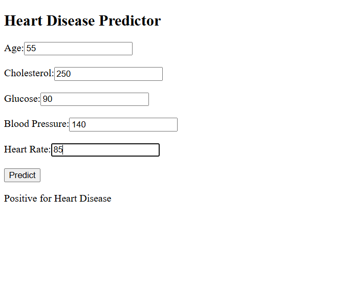

# ❤️ Heart Disease Prediction App

A simple and interactive machine learning web app that predicts whether a person is at risk of developing heart disease based on key health metrics.

---
## 🧠 Features

- Predicts heart disease risk using Random Forest Classifier
- Takes 5 important input features:
  - Age
  - Total Cholesterol
  - Glucose
  - Systolic Blood Pressure (sysBP)
  - Heart Rate
- Built using *Python, **Flask, **HTML/CSS*
- Clean, responsive UI
---

## 📂 Project Structure
 Heart-Disease-Prediction/ ├── app.py ├── index.html ├── style.css ├── model.pkl ├── framingham.csv ├── requirements.txt ├── Heart Disease Prediction.py  # Model training script ├── README.md └── screenshot.png               # Add your screenshot image here

---

## ⚙️ Installation & Running

1. Clone this repository  
   ```bash
   git clone
https://github.com/ThanujaThirumala/Heart-Disease-Prediction.git

2. Install required libraries
   pip install -r requirements.txt
3. Run the Flask app
   python app.py

4. Open in browser:

   http://127.0.0.1:5000/
---


### Tech Stack

Python  
Flask  
HTML5 / CSS3  
Scikit-learn  
Pandas / NumPy  

---

### 🔍 Output Screenshot



---

✍️ *Author*  
Thanuja Thirumala  

> Made with ❤️ for internship project presentation